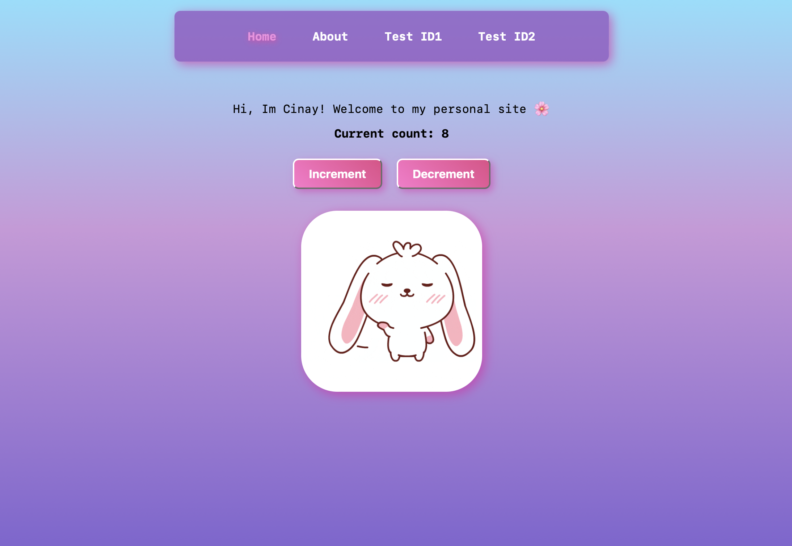
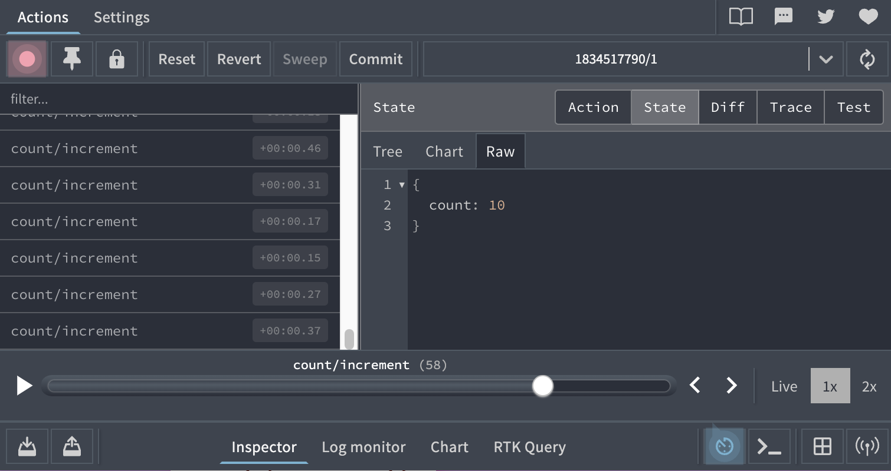

# Upgraded Starter Pack - Cinay D.

Completed updgrading the starter pack to have Zustand state management! :D

[deployed url](https://starterpack-cdilibal.onrender.com/)

## What Worked Well

I successfully integrated Zustand into the frontend starter pack without breaking existing functionality.
The store setup worked smoothly, allowing state management with minimal boilerplate. Also, the Counter and Controls components correctly accessed and modified the global state.

## What Didn't

## Routes Implemented
- / displays the Welcome component and Nav.
- /about displays the About component and Nav.
- /test/:id dynamically displays the Test component and shows the ID from the URL.

also implemented a fallback route for unknown URLs to display a “URL Not Found” message.

## Extra Credit

- I made sure my site looks extra cute with fun designs! :D

## Screenshots

I got a bit of help from ChatGPT for debugging and resolving issues during the process.
