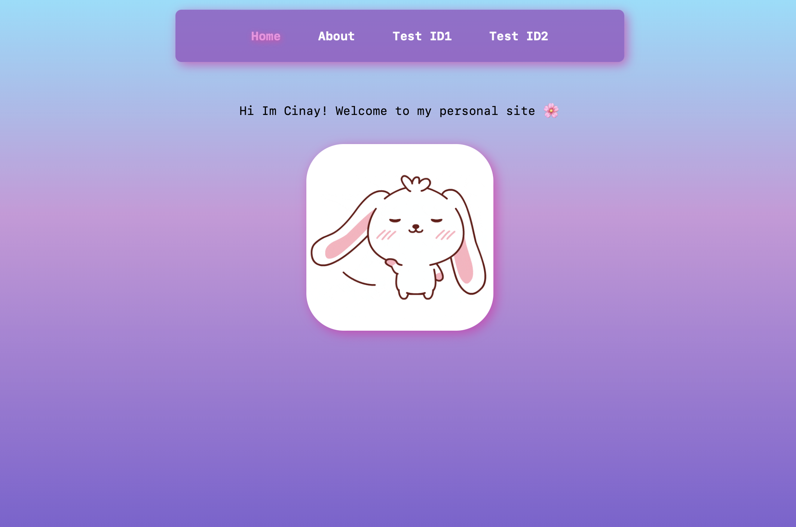
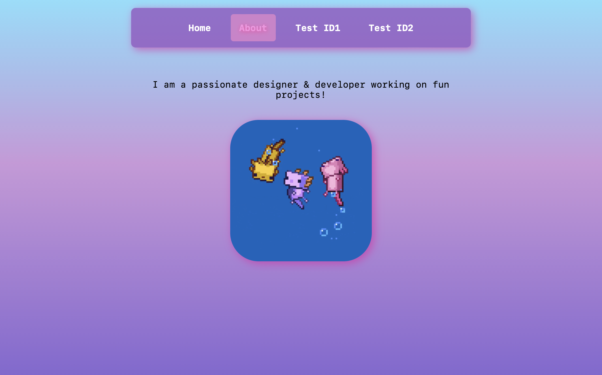

# Upgraded Starter Pack - Cinay D.

Completed updating the starter pack! Added routing to my React app using React Router. Now, I can navigate between different pages like Welcome, About, and Test using URLs. :D

[deployed url](https://starterpack-cdilibal.onrender.com/)

## What Worked Well

The routing integration went pretty smoothly. I set up routes for different components, added fallback routes for unknown URLs, and everything’s working as expected. Also added styling so it looks cute!

## What Didn't

## Routes Implemented
- / displays the Welcome component and Nav.
- /about displays the About component and Nav.
- /test/:id dynamically displays the Test component and shows the ID from the URL.

also implemented a fallback route for unknown URLs to display a “URL Not Found” message.

## Extra Credit

- I made sure my site looks extra cute with fun designs! :D

## Screenshots

I got a bit of help from ChatGPT for debugging and resolving issues during the process.
