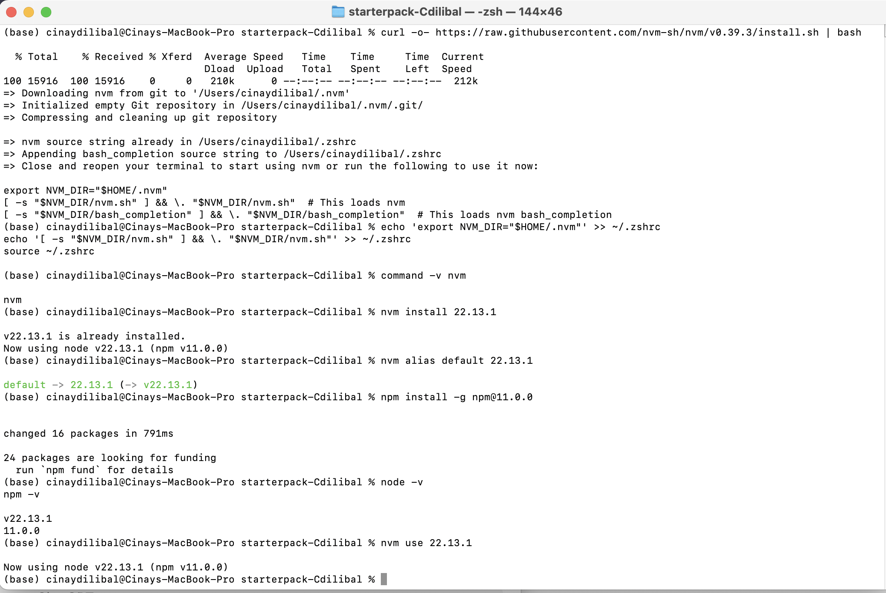
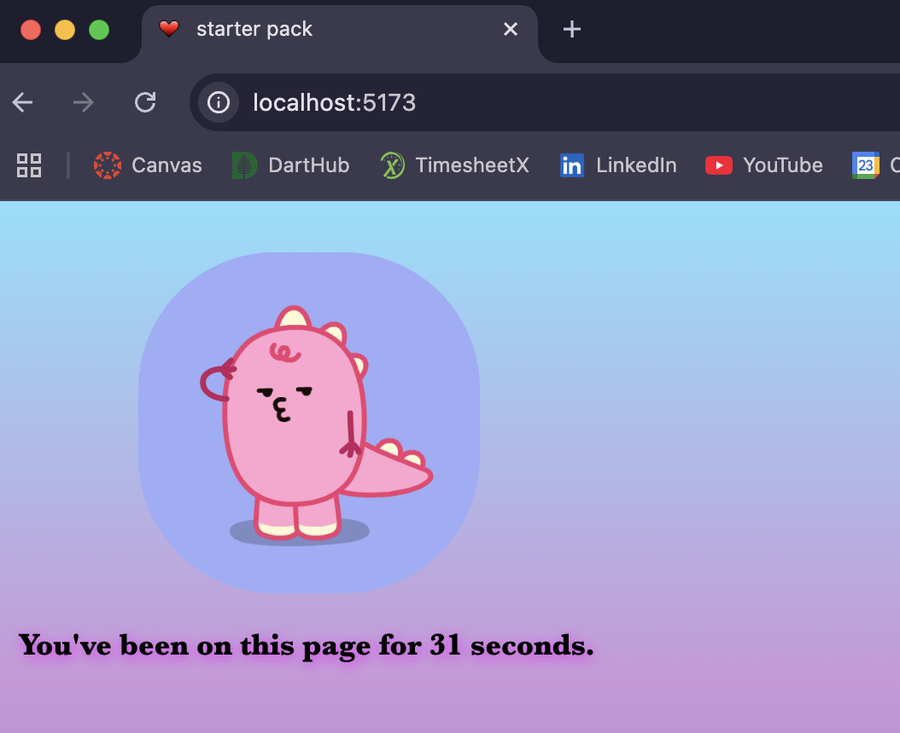
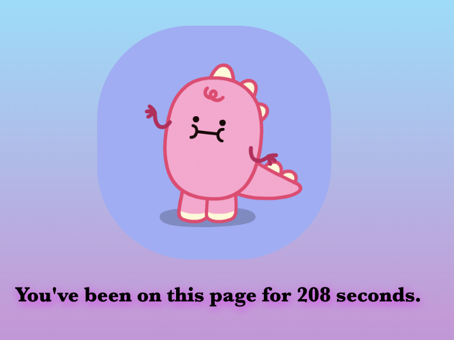

# Starter Pack - Cinay D.

Completed setting up the starter pack. Also completed the extra credit for it! :D

[deployed url](https://starterpack-cdilibal.onrender.com/)

## What Worked Well

I got everything to work smoothly, and ready to go. I set up a Vite project, installed a Node version manager (NVM), and configured a favicon for the site (extra credit). I also added the ESLint and Autoprefixer plugins, wrote a simple JavaScript counter to update the page every second, and configured SCSS for custom styling!

## What Didn't

## Extra Credit

- I successfully installed and configured a Node Version Manager, enabling me to manage and switch between different Node.js versions across projects.

- I also completed the favicon icon setup by adding a favicon.ico file to the public folder of my Vite project and ensuring it was correctly linked in the head section of the index.html file.

## Screenshots

I got a bit of help from ChatGPT for debugging and resolving issues during the process.
